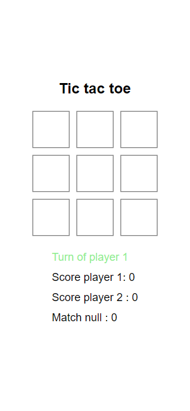

## How I write my TIC TAC TOE game with Functions

This is a simple Tic-Tac-Toe game implemented in JavaScript that can be played in the browser.

## Table of contents

- [Overview](#overview)
  - [Screenshot](#screenshot)
- [My process](#my-process)
  - [Built with](#built-with)
  - [What I learned](#what-i-learned)
  - [Continued development](#continued-development)
  - [Useful resources](#useful-resources)
- [Author](#author)
- [Acknowledgments](#acknowledgments)

## Overview

This is a JavaScript implementation of the classic game Tic-Tac-Toe. The game is played on a 3x3 grid, and players take turns marking X or O in a cell. The first player to get three in a row wins the game. The code uses the Document Object Model (DOM) to dynamically render the game board and update the game state.

Overall, creating a game like Tic-Tac-Toe can be a great way to learn more about web development, and it's always satisfying to see a functioning game come to life through your code.

### Screenshot

## My process (code explain)

1 - The code uses an event listener to check if any of the boxes in the game are clicked, and then calls the boxChecker() function.

2 - The boxChecker() function checks if the clicked box has already been selected and returns false if it has. 
If the box hasn't been selected, the function then determines whether to display an "X" or an "O" on the box based on the current player's turn. The function then updates the boxesState object with the current player's number and calls the verifyVictory() and turnSwitcher() functions.

3 - The turnSwitcher() function switches the current player to the other player's turn and updates the currentPlayer variable to reflect the change.

4 - The verifyVictory() function checks if any of the players have won the game or if the game has ended in a tie. If a player has won the game, the victoryAlert() function is called and the winning player's score is updated. If the game has ended in a tie, the nullAlert() function is called and the number of tie games is updated. Otherwise, the function returns false.

5 - The victoryAlert() function displays a message to the player who won the game and then resets the game board by calling the gameReset() function.

6 - The nullAlert() function displays a message to the players that the game has ended in a tie and then resets the game board by calling the gameReset() function.

7 - The gameReset() function resets the boxesState object and clears the contents of all the boxes on the game board.

### Built with

- CSS
- JavaScript 

### What I learned

1 - Manipulating the DOM
2 - Working with Objects
3 - Working with Functions / Arrow Functions

Manipulating the DOM: I learned how to manipulate the Document Object Model (DOM) to dynamically update the content on the web page. This was especially important for the game board, where I needed to update the cells with X's and O's as players made their moves.

Working with Objects: I used objects to store the game state and player information. This made it easy to access and update the game data throughout the code. I also used objects to represent the game board, which made it easier to check for winning conditions.

Working with Functions / Arrow Functions: I used functions to handle various aspects of the game logic, such as checking for a winner or updating the game state. I also used arrow functions to simplify my code and make it more concise.

Overall, building this tic-tac-toe game taught me a lot about web development concepts and helped me gain more experience with manipulating the DOM, working with objects, and using functions and arrow functions in JavaScript.

### Continued development

I plan to continue this project by adding some features like button to restart score.
Add some design UI feature and edit more CSS part. 

### Useful resources

- [Screen Shot tools] (https://chrome.google.com/webstore/detail/gofullpage-full-page-scre/fdpohaocaechififmbbbbbknoalclacl/related) - This an amazing screenShot tool

## Author

I am a junior JavaScript developer who is passionate about web development. I am actively seeking job opportunities to further my skills and gain real-world experience. 

If you are interested in hiring a motivated and dedicated junior developer, please don't hesitate to contact me through my LinkedIn account or email at ynsyldz44800@gmail.com. I look forward to hearing from you!

- Youtube chanel- [Yunus Yildiz](https://www.youtube.com/channel/UCHcbGs0_a6xnTPpbkoRaGuw) (Maybe I'll produce some dev stuff on it)
- Linkedin - https://www.linkedin.com/in/yunus-yildiz-b919b7206/

## Acknowledgments

Thank to chat GPT !
